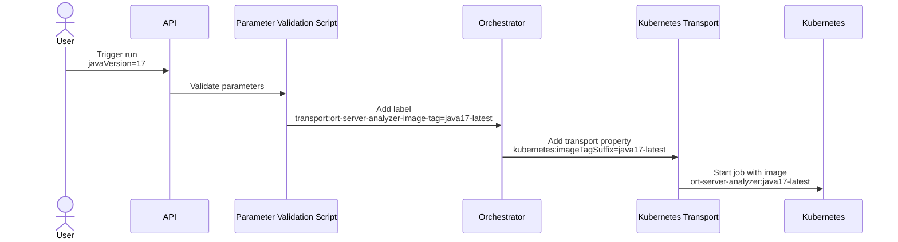

# Support for Different Tool Versions

This document describes the concept used within ORT Server to support different versions of tools at the same time.

## Problem Description
Some parts of ORT Server, especially the Analyzer, face the problem that specific versions of tools must be present in order for an ORT run to be successful.
A prominent example is the Java version:
ORT runs itself on a Java VM, and Java-based build tools are invoked in this VM.
This naturally restricts the Java versions of projects that can be analyzed.
So it is typically not possible to handle a project that requires a newer Java version than the one ORT is using.
But also the opposite direction, a project targeting an old Java version, can be problematic. For instance, older Gradle versions are unable to run on newer Java SDKs.

Java is not the only example for issues in this category. Such conflicts can occur for other (build) tools as well.
Even the ORT version itself could be a source of problems, for instance, if breaking changes are introduced that are required by one project, but would break another one.

In the original usage scenario with ORT as a command line tool, such conflicts are less of an issue.
It is possible to set up the local environment according to the specific project needs or use an ORT Docker image containing the tools in the desired versions (when building a custom Docker image for ORT the versions of most tools can be specified).
With ORT Server, the situation looks different.
A server should always be up; it is not an option to redeploy the whole system whenever a specific project requires different tool versions.
So, a dynamic solution is needed that supports selecting different tool versions at runtime.

## Solution Idea
What is helpful in the current context is the fact that during processing of an ORT run, multiple separate components are involved:
the Orchestrator calls the single workers, like Analyzer, Scanner, Reporter, etc., in the correct order to produce the final results.
These calls are done through a [transport abstraction layer](../../transport/README.adoc).
This enables great flexibility for possible ORT Server deployments.

The basic idea is now that a concrete transport implementation can be made aware of the tool version constraints for the current project, so that the call could be dispatched differently.
How this dispatching is done in a way that the constraints are fulfilled is implementation-specific.

Nowadays, deployments are typically based on container images.
So, supporting multiple tool versions would mean having different container images for workers that contain the tools in the required versions.
It then needs to be ensured that a request from the Orchestrator is processed by the correct worker image.
Let's look at some concrete examples:

* For the [Kubernetes transport abstraction](../../transport/kubernetes/README.md), the container image to be launched is defined in a (static) configuration.
  The mechanism to determine the target container image can be extended to take other properties into account, so that the image name and/or tag are generated dynamically.
  For instance, for a project that sticks with Java 11, the Analyzer endpoint could launch a container based on the image `ort-server-analyzer:java11-latest`, while a project requiring Java 17 would use the image `ort-server-analyzer:java17-latest`.
  In this scenario, no changes on the ORT Server deployment would be required to add support for new tool versions; only a new container image following the naming conventions in place has to be added to the container registry.
* Transport implementations based on messaging could similarly derive the name of the target message queue from the version constraints of the current project.
  In this scenario, container images with specific tool versions are listening on dedicated messages queues and are processing only compatible projects.
  Supporting a new tool version would mean adding a new message queue and deploying a corresponding listener service.

After the basic idea has been presented, the next section discusses how the specification of tool version constraints and the corresponding dispatching could look like.

## Configuration
To make sure that projects to be analyzed are processed by workers offering the tools in the required versions, two requirements must be fulfilled:

* Projects must be able to specify version constraints.
* The transport implementation must be passed such constraints and understand them.

Because of the desired flexibility of ORT Server with regard to its runtime environment, defining strict mapping rules is not possible.
Users of ORT Server will have their own naming conventions for their container images.
They will typically require only a limited variance in versions of specific tools, which will also impact the names of container images that are chosen.
Being fully flexible in the versions of all supported tools would lead to a combinatorics explosion.
So, the configuration mechanism needs to be quite flexible as well.

When triggering an ORT run, users must be able to specify information about version constraints in a generic way.
With labels, ORT (and ORT Server) already supports a mechanism to provide arbitrary data that is available during the whole run.
So it would be possible to define a specific prefix, e.g., _transport:_, for labels that are intended to be evaluated by transport implementations.

When invoking a worker, the Orchestrator could extract all labels starting with this prefix and add them to the message that triggers the worker.
For this, the `Message` class would have to be extended.

This approach would have the additional benefit that other dynamic configuration information specific for the transport implementation in use could be handled.
One example of such additional properties could be CPU and memory limits for Kubernetes pods that could be adapted to the expected result size.

The transport implementation has its own configuration which is currently static.
This could be extended to support special placeholders in the values of configuration properties that are substituted with corresponding label values.
That way, the behavior of a transport can be influenced in a generic way.

Let's make this more concrete with an example using the Kubernetes transport implementation.
The following diagram shows the data flow from a request to trigger an ORT run until the start of the container image for the Analyzer as a Kubernetes job.

The flow begins with the user sending a request to trigger a run for a specific repository.
As described under [Parameters when triggering an ORT run](../../website/docs/guides/parameter-validation-script.md), the API to trigger requests can be customized using a validation script.
In this example, the script supports a _javaVersion_ parameter in the generic parameters of the Analyzer job configuration.
The value is the version of the JDK that needs to be installed in the container image running the Analyzer step.

The validation script processes the parameters in the trigger request and generates a resolved configuration out of it.
This configuration is the exact specification of the ORT run to start.
For this specific case, the script has added a special label to the map with labels provided by the user.
The key of this label indicates that it is going to be consumed by the transport implementation.
The value is a suffix following the naming conventions of this ORT Server installation to identify a specific container image.

The request to trigger the run is now processed and delegated to the Orchestrator, the component responsible for invoking the single workers.
The invocation is done by passing a message to the configured transport implementation.
The message header contains some metadata about the current ORT run and also a map with properties to be consumed by concrete transport implementations.
When constructing the message, the Orchestrator populates this map based on the labels set for this run by selecting all the keys starting with the prefix _transport:_ and removing this prefix.
The flow diagram shows the resulting message.

The message is now processed by the transport implementation, which is based on Kubernetes in this concrete example.
For the Kubernetes transport, processing a message means starting a job in Kubernetes whose details are determined by a number of configuration settings.
Among other things, the name of the container image for the job and the namespace in which to start it can be defined.
Here, the container image to launch depends on the Java version required by the project.
Therefore, the image name specified in the configuration contains a variable (`$+{imageTagSuffix}+`).
For specific configuration settings, the Kubernetes transport does a variable substitution based on the passed in message properties.
It gets the values for variables by filtering the properties for the key prefix _kubernetes:_.
This results in a container image name including the string "java17" in its tag.
That way, the Analyzer step can run on different Java versions.

The concept is generic and can be ported to other transport implementations and use cases.
For instance, a transport implementation using message queues could support variables in the configuration of the queue names.
Or, if flexibility in multiple tool versions is needed, the transport configuration could contain multiple variables to support the combination of all possible tools and their versions.
So great flexibility can be achieved.
But the basic elements of the solution are always the same:

* The validation script sets specific labels, based on parameters in the trigger request or other use case-specific criteria.
* The transport implementation references these labels in its configuration to achieve different behavior depending on the concrete values.
