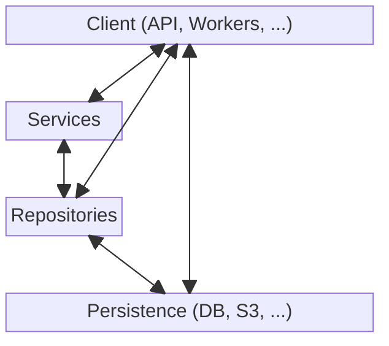
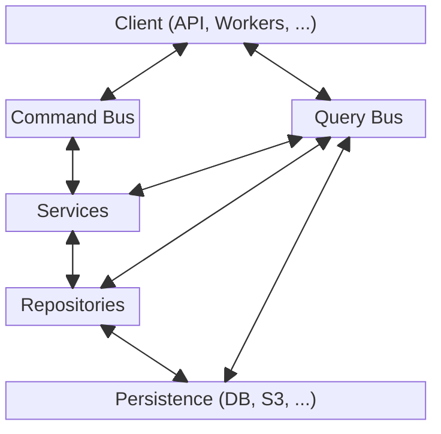

# Before

```mermaid
block-beta
  columns 3
  client["Client (API, Workers, ...)"]:3
  space:3
  service["Services"] space:2
  space:3
  repo["Repositories"] space:2
  space:3
  persistence["Persistence (DB, S3, ...)"]:3

  client --> service
  service --> client

  client --> repo
  repo --> client
  service --> repo
  repo --> service

  client --> persistence
  persistence --> client
  repo --> persistence
  persistence --> repo
```

# After

```mermaid
block-beta
  columns 3
  client["Client (API, Workers, ...)"]:3
  space:3
  command["Command Bus"] space query["Query Bus"]
  space:3
  service["Services"] space:2
  space:3
  repo["Repositories"] space:2
  space:3
  persistence["Persistence (DB, S3, ...)"]:3

  client --> command
  command --> client
  client --> query
  query --> client

  command --> service
  service --> command
  query --> service
  service --> query

  service --> repo
  repo --> service
  query --> repo
  repo --> query

  repo --> persistence
  persistence --> repo
  query --> persistence
  persistence --> query
```
