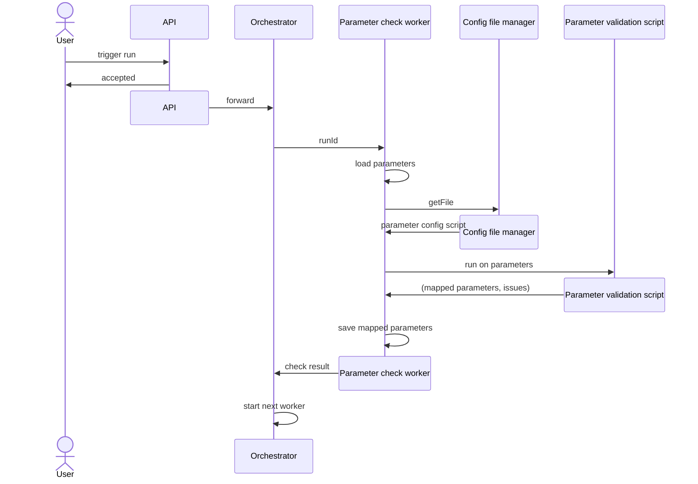

# Parameter Validation Script

This document describes the mechanism how the parameters of an ORT run can be specified when invoking the corresponding API endpoint and how this can be customized.

## Problem

In the data model of ORT Server, so-called _job configurations_ are used to specify the exact behavior of workers, like the Analyzer, the Scanner, etc. While some parts of such configurations are rather straight-forward, e.g. flags like `skipExcluded`, others are not and partly require a deep technical knowledge about the runtime environment and how it is configured. To give a few examples:

- When specifying the list of _advisors_ to run, their configuration is expected. This includes information like URLs of external systems and access credentials.
- Some workers rely on plugins that implement the actual functionality. Those plugins expect their configuration in maps containing key-value pairs; and the whole plugin configuration is a map that uses the plugin names as keys and the plugin options as values. So, the name of plugins and their supported options must be known.
- The rules to be processed by the Evaluator must be loaded from somewhere. Where are they located and how can they be accessed?
- The situation for template files to be consumed by the Reporter is similar; they also need to be retrieved from a specific location.

Requiring such deep knowledge from callers may be fine in some situations; e.g. if ORT Server is called from an external system. End users, however, will not have this information, nor should they (especially when it comes to access credentials to external systems).

So the job configurations are typically not a suitable model for end users to specify the parameters of an ORT run. They also do not support other use cases that may come up when integrating ORT Server with local compliance guidelines, for instance of a company. Depending on a concrete setup, there might be restrictions on the parameters that can be specified by users; or other parameters are needed that are not known to the standard model of ORT Server. Examples could be:

- The rule set for Evaluator should not be freely chosen, but instead be selected based on an application category (such as server application, desktop application, etc.).
- There is a predefined set of advisors to run that should not be changed.
- A company uses a custom scanner plugin that requires some special parameters to be set.
- There are a number of FossID instances available the user can choose from. But the selection should be based on a logic name, abstracting away from technical details like the URL in the network or the credentials.

What is basically needed is a way to customize the rather technical API of ORT Server towards the needs and capabilities of the environment in which it is running, so that it can be used from clients in a convenient and safe way.

## Parameter Configuration

To address these issues, ORT Server uses a validation and mapping approach of run parameters based on a scripting solution. The idea is as follows:

When Orchestrator receives a request to trigger an ORT run, before starting the Analyzer step, it invokes a special worker for validating and processing the run parameters provided by the user. This worker loads the job configurations and additional parameters for the current ORT run from the database. It loads a file with the current parameter configuration. This is basically a Kotlin script that takes the parameters provided by the user as input and returns processed parameters and a collection of issues (if any) as output. The script can now perform mapping and validation steps, such as:

- check whether certain parameters have a defined set of values; e.g., only rule sets "standard", "web", "special" are allowed
- map the values given by the user to other values; e.g., the rule set "standard" could be mapped to a specific configuration file path from where it can be downloaded
- create specific job configurations for parameters; e.g., the users can specify a set of FossID parameters, which are then added to the corresponding options in the scanner configuration

For example, a validation script could use the parameters to configure the scanner and evaluator jobs.

The following input:

```json
{
  "jobConfigs": {
    "parameters": {
      "applicationCategory": "web",
      "useFossId": true,
      "fossIdInstance": "QM",
      "fossIdDeltaScans": 7
    }
  }
}
```

Could be transformed to these job configurations:

```json
{
  "resolvedJobConfigs": {
    "scanner": {
      "scanners": ["FossId"],
      "config": {
        "FossId": {
          "options": {
            "serverUrl": "https://fossid-qm.example.org",
            "deltaScans": true,
            "deltaScanLimit": 7
          },
          "secrets": {
            "user": "fossIdUser_QM",
            "apikey": "fossIdApiKey_QM"
          }
        }
      }
    },
    "evaluator": {
      "ruleSet": "web.rules.kts",
      "licenseClassificationsFile": "web.license-classifications.yml"
    }
  }
}
```

Here the request passed to Orchestrator contains a number of simple key-value pairs. The validation script reads this input and performs the following transformations:

- It detects that FossID should be used. Therefore, it makes sure that the output contains a `ScannerJobConfiguration` with options that include a map for FossID-related parameters.
- Users specify the FossID instance to be used as an enumeration constant - _QM_ in this case. The script can check whether this is an allowed value. If so, it adds the data of the selected instance to the FossID configuration - in this case the URL and the credentials. _Note:_ The credentials are represented as names of secrets that need to be looked up later, not as the actual secret values.
- Further parameters related to FossID, e.g., the number of delta scans to keep, are also added to the FossID options in the scanner configuration.
- The _applicationCategory_ parameter is also checked for correctness. In this example, the category determines the Evaluator configuration to be used, i.e., the rule set and the license classifications. The validation script therefore creates an `EvaluatorJobConfiguration` and populates it accordingly.

The following sequence diagram shows the interactions between Orchestrator, the parameter check worker, the validation script, and others in detail. This is a more formal description of what was stated before in the text:


